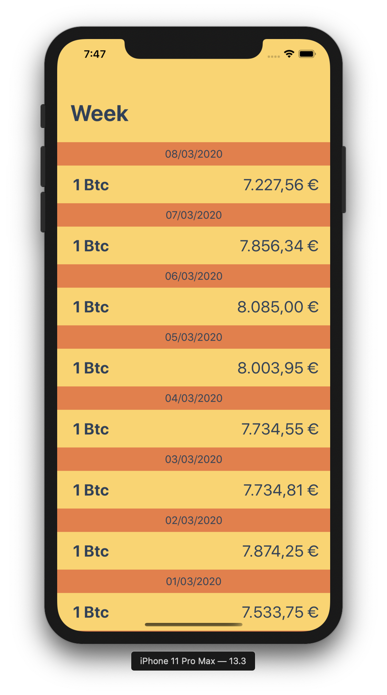
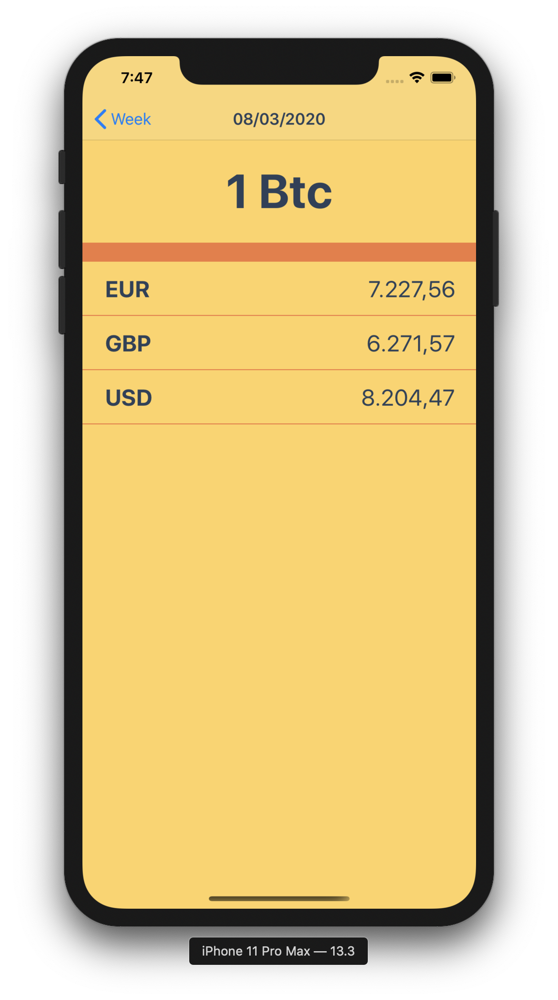
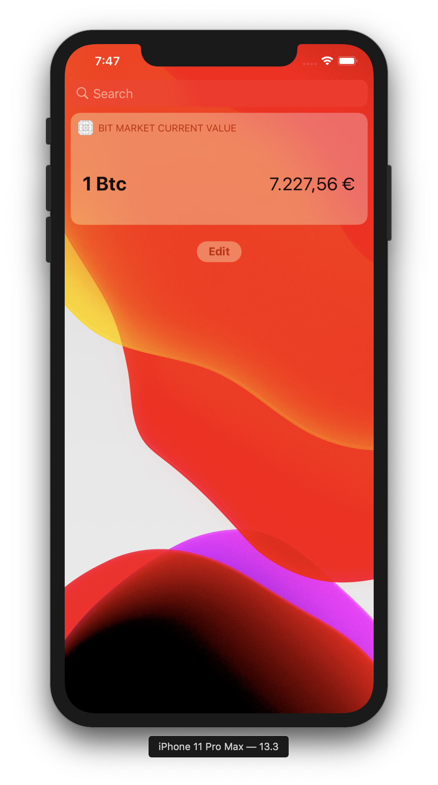

# Bit Market
  

### Description
This app shows the bitcoin price historical in EUR for the past two weeks including today. It also has a widget to show the current value of Bitcoin in EUR.
  

## Platform
iOS
- Minimum Version: 13.2

## Configuration
The application is currently with a problem with its frameworks, so it only can be executed on simulator.

To manage the dependencies of the project was used [Cocoa Pods](https://cocoapods.org/).

First, it's necessary to clone the project.

`- git clone https://github.com/cardoso19/bitMarket.git`

If you don't have Cocoa Pods installed on your computer yet, run the code below on the terminal to install it:

`sudo gem install cocoapods`

After the project had been cloned, inside of the generated directory, using Terminal execute the command:

`pod install`

With the dependencies managemend has been made by Cocoa Pods, to run the project you need to open it by clicking on the file "BitMarket.xcworkspace".